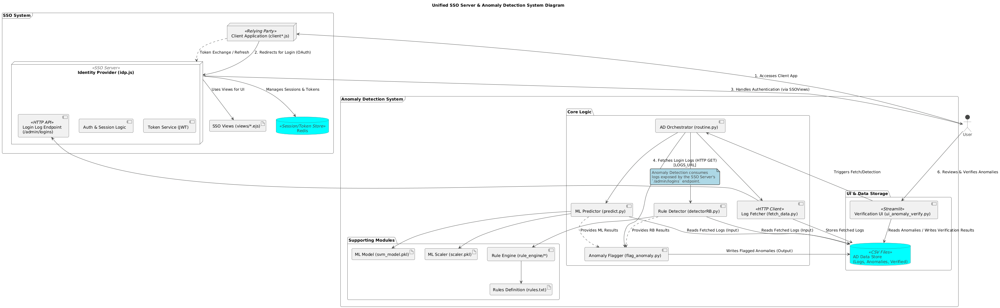

# SSO Server with Integrated Login Anomaly Detection

This project integrates a robust Single Sign-On (SSO) server with a sophisticated Anomaly Detection system designed to identify suspicious login attempts, providing enhanced security monitoring for your application ecosystem.

## 📝 Overview

The system consists of two main parts:

1.  **OneLogin SSO Server:** A Node.js-based SSO solution supporting multiple client applications, JWT-based authentication, token refresh flows, and centralized session management using Redis. Crucially, it **exposes a log of login attempts** at a configurable endpoint.
2.  **Anomaly Detection System:** A Python-based system that fetches login logs from the SSO server's endpoint. It uses a combination of **rule-based logic** and a **pre-trained Machine Learning (SVM) model** to detect potentially malicious login activities. Detected anomalies can be reviewed and verified by experts through an interactive **Streamlit UI**, creating a feedback loop for continuous improvement.

The integration point is the Anomaly Detection system's ability to fetch data directly from the SSO server's designated log endpoint (`/admin/logins` by default), enabling near real-time monitoring of authentication events.

## Overall Architecture



## ✨ Combined Features

**SSO Server Features:**

* **Single Sign-On & Single Sign-Out:** Log in/out once across all connected applications.
* **Multi-Client Support:** Easily register and manage multiple client applications.
* **JWT Authentication:** Secure, industry-standard token-based authentication (Access & Refresh Tokens).
* **Redis Token & Session Management:** Scalable and efficient state management using Redis.
* **Session Dashboard:** Central interface (part of SSO server) to view active sessions.
* **Login Log Exposure:** Publishes login attempt data via a dedicated API endpoint for monitoring.

**Anomaly Detection Features:**

* **Log Fetching:** Retrieves login logs from the configured SSO server endpoint.
* **Rule-Based Detection:** Applies custom, human-defined rules (`rules.txt`) to identify known suspicious patterns.
* **ML-Based Detection:** Employs a pre-trained SVM model to identify anomalous logins based on learned patterns.
* **Expert Verification UI:** Interactive Streamlit interface (`ui_anomaly_verify.py`) for manual review and confirmation of flagged anomalies.
* **Feedback Loop:** Verified anomalies can be used to refine rules or retrain the ML model.
* **Synthetic Data Generation:** Utility to create dummy log data for testing and model training.
* **Docker Support:** Fully containerized for easy deployment and dependency management.

## 🏛️ Architecture

1.  A **User** attempts to log in to a **Client Application**.
2.  The Client Application redirects the User to the **SSO Server (IDP)**.
3.  The User authenticates with the SSO Server.
4.  The SSO Server **logs the login attempt** (success/failure, timestamp, user ID, IP address, etc.) and stores session/token data in **Redis**.
5.  The SSO Server exposes these login logs via the `/admin/logins` endpoint.
6.  The **Anomaly Detection System** periodically (or on demand) **fetches** these logs from the SSO Server's endpoint.
7.  The AD System applies **rule-based** and **ML-based detection** algorithms to the fetched logs.
8.  Detected anomalies are stored (e.g., `data/rb_anomalies.csv`, `data/ml_anomalies.csv`).
9.  An **Expert/Admin** uses the **Anomaly Detection UI** (Streamlit) to review flagged anomalies.
10. The expert verifies anomalies, and this feedback is stored (`data/verified/`). This data can potentially be used for retraining the ML model.

## 📋 Prerequisites

* **For SSO Server:**
    * Node.js (v12.0.0 or higher)
    * npm (v6.0.0 or higher)
    * Redis server (v5.0.0 or higher) running and accessible.
* **For Anomaly Detection System:**
    * Docker
    * Python 3.x (if running outside Docker or for development/training)

## ⚙️ Installation & Setup

You need to set up and run both systems.

**1. Setup and Run the SSO Server:**

   a. Clone the SSO Server repository (assuming it's separate):
      ```bash
      git clone <sso-server-repository-url>
      cd <sso-server-directory>
      ```
   b. Install dependencies:
      ```bash
      npm install
      ```
   c. Ensure your Redis server is running. Configure the connection if needed (default `REDIS_URL=redis://localhost:6379`).
   d. Start the main SSO Server (Identity Provider). By default, it runs on port `3000`:
      ```bash
      # Make sure idp.js is configured to expose logs at /admin/logins
      nodemon idp.js
      ```
   e. In separate terminals, start any client applications required for testing:
      ```bash
      nodemon client1.js # Typically runs on port 3001
      nodemon client2.js # Typically runs on port 3002
      ```
   f. **Verify:** Ensure the SSO server is running and that you can access the login log endpoint (e.g., `http://localhost:3000/admin/logins`) and see login data after performing some logins.

**2. Setup and Run the Anomaly Detection System:**

   a. Clone the Anomaly Detection repository:
      ```bash
      git clone [https://github.com/AbhiZx18324/3SO.git](https://github.com/AbhiZx18324/3SO.git)
      cd 3SO/anomaly-detection
      ```
   b. Build the Docker Image:
      ```bash
      docker build -t anomaly-detector .
      ```
   c. Run the Docker Container:
      * This command maps the UI port (`8501`) and importantly uses `--add-host` to allow the container to reach the SSO server running on your host machine via `host.docker.internal`.
      * The default `LOGS_URL` environment variable (`http://host.docker.internal:3000/admin/logins`) should now correctly point to your SSO server's log endpoint from within the container.
      ```bash
      docker run -p 8501:8501 --add-host=host.docker.internal:host-gateway anomaly-detector
      ```
   d. **Access the Anomaly Detection UI:** Open your web browser to `http://localhost:8501`.

## 🛠️ Configuration

**SSO Server:**

* **Redis Connection:** Set via the `REDIS_URL` environment variable or within `idp.js`.
* **Client Applications:** Register client IDs, secrets, and redirect URIs within `idp.js`.
* **Log Endpoint:** Ensure the `/admin/logins` route in `idp.js` is correctly implemented to return login data in a format consumable by the Anomaly Detection system (likely CSV or JSON).

**Anomaly Detection System:**

* Configuration is primarily managed through **environment variables** (or defaults in the code). These can be set when running the Docker container (e.g., using `docker run -e VAR_NAME=value ...`).

| Variable                | Default                                   | Description                                             |
| :---------------------- | :---------------------------------------- | :------------------------------------------------------ |
| `RULES_FILE`            | `rule/rules.txt`                          | Path to rule definitions                                |
| `LOGS_FILE`             | `data/logs.csv`                           | Fallback log file location (if fetching fails)          |
| `LOGS_URL`              | `http://host.docker.internal:3000/admin/logins` | **Endpoint to fetch login logs from SSO Server** |
| `RB_RESULT_FILE`        | `data/rb_results.csv`                     | Rule-based detection raw results                         |
| `RB_ANOMALIES_FILE`     | `data/rb_anomalies.csv`                   | Flagged rule-based anomalies                            |
| `ML_ANOMALIES_FILE`     | `data/ml_anomalies.csv`                   | Flagged ML-based anomalies                              |
| `ML_VERIFIED_ANOMALIES` | `data/verified/ml_verified_anomalies.csv` | Expert Verified ML anomalies                            |
| `RB_VERIFIED_ANOMALIES` | `data/verified/rb_verified_anomalies.csv` | Expert Verified rule-based anomalies                    |
| `ML_MODEL_PATH`         | `utils/ML/svm_model.pkl`                  | Path to the pre-trained SVM model file                  |
| `ML_SCALER_PATH`        | `utils/ML/scaler.pkl`                     | Path to the pre-trained scaler file                     |

## ▶️ Workflow & Usage

1.  Start the Redis server.
2.  Start the SSO Server (`idp.js`) and any required Client Applications (`client*.js`).
3.  Start the Anomaly Detection System container.
4.  Perform logins/logouts using the Client Applications, which interact with the SSO Server.
5.  The SSO Server logs these events.
6.  Access the Anomaly Detection UI at `http://localhost:8501`.
7.  Use the UI to trigger the "Fetch Data" operation (pulls logs from `LOGS_URL`).
8.  Run the detection algorithms (Rule-Based, ML-Based) via the UI.
9.  Review the flagged anomalies listed in the UI.
10. Mark anomalies as "Verified True Positive" or "False Positive". Verified data is saved.

## 🔑 Token Management (SSO)

The SSO server uses JWT Access Tokens (short-lived, e.g., 1 hour) and Refresh Tokens (long-lived, e.g., 30 days) stored and managed via Redis for secure and persistent user sessions across clients.

## 🧪 Rule Writing & Model Training (Anomaly Detection)

* **Rules:** Define custom detection rules in `rule/rules.txt`. Refer to `rule/syntax.txt` for guidance. The `rule_engine/` modules parse and apply these rules.
* **ML Model:** The system uses a pre-trained SVM model located in `utils/ML/`. To retrain:
    * Ensure you have sufficient high-quality log data (fetched or synthetic, ideally >10,000 points including verified anomalies).
    * Use the `utils/model.ipynb` notebook to train a new model and scaler.
    * Save the updated `.pkl` files to `utils/ML/`. You might need to rebuild the Docker image or mount the models volume if updating frequently.

## 🔒 Security Considerations

* **HTTPS:** Always use HTTPS in production for both SSO and Anomaly Detection communications.
* **Secrets Management:** Securely manage client secrets (SSO) and any sensitive configuration for the AD system.
* **Input Validation:** Sanitize and validate data fetched from the log endpoint.
* **CSRF Protection:** Use the `state` parameter in OAuth flows (SSO).
* **Redis Security:** Secure your Redis instance (authentication, network access).
* **Rate Limiting:** Consider rate limiting on both the SSO log endpoint and the AD UI.
* **Access Control:** Secure the Anomaly Detection UI itself if deployed in a shared environment.

## ❓ Troubleshooting

* **AD Can't Fetch Logs:**
    * Verify the SSO server (`idp.js`) is running.
    * Check if the `/admin/logins` endpoint on the SSO server is accessible and returns data correctly (use `curl` or a browser from *within* the AD container if possible: `docker exec <container_id> curl http://host.docker.internal:3000/admin/logins`).
    * Ensure firewall rules aren't blocking access between the container and the host.
    * Confirm the `LOGS_URL` points to the correct address accessible from the Docker container (`host.docker.internal` is usually correct for host access).
* **SSO Issues (Token/Session):** Refer to the original SSO Server README's troubleshooting section (JWT secrets, Redis connectivity, code expiration).
* **Docker Issues:** Check container logs (`docker logs <container_id>`) for errors related to Python scripts, dependencies, or network access.

---

This merged README provides a comprehensive guide to understanding, setting up, and using the integrated SSO and Anomaly Detection system. Remember to adapt repository URLs and specific file paths if your actual project structure differs.