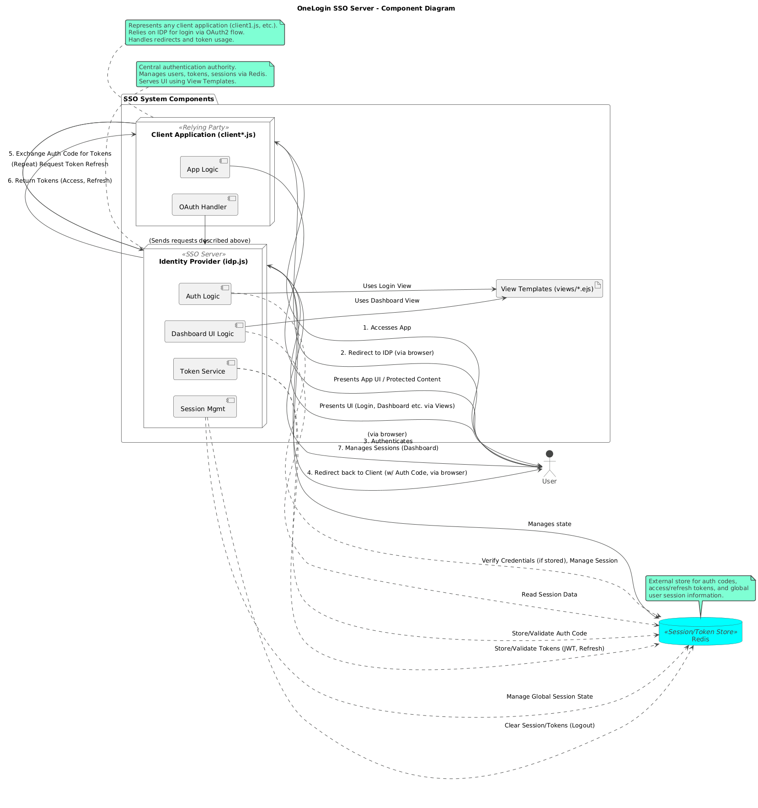

# OneLogin SSO Server Implementation

A complete Single Sign-On (SSO) solution with multi-client support, token-based authentication, and Redis session management.

# 🧩 System Architecture



## 🚀 Features

- **Single Sign-On** - Log in once and access all connected applications
- **Single Sign-Out** - Log out from all applications with one click
- **Session Dashboard** - View and manage all active sessions from a central interface
- **Redis Token Management** - Secure token storage with configurable expiration
- **JWT Authentication** - Industry-standard JSON Web Tokens for authentication
- **Token Refresh Flow** - Implements access token and refresh token architecture
- **Centralized Session Management** - Track user sessions across multiple applications
- **Scalable Architecture** - Easily add new client applications to your SSO ecosystem

## 📋 Prerequisites

- Node.js (v12.0.0 or higher)
- npm (v6.0.0 or higher)
- Redis server (v5.0.0 or higher)
- Express.js

## 📁 Project Structure

```
OneLogin-SSO-Server/
│
├── client1.js             # Client application 1
├── client2.js             # Client application 2
├── idp.js                 # Identity Provider (SSO server)
├── package.json           # Project dependencies
├── package-lock.json      # Locked dependencies
├── README.md              # Project documentation
├── .gitignore             # Git ignore file
│
└── views/                 # View templates
    ├── dashboard.ejs      # Admin dashboard for session management
    ├── error.ejs          # Error page
    ├── home.ejs           # Client application home page
    ├── login.ejs          # Login page
    ├── profile.ejs        # User profile page
    └── signedout.ejs      # Logout confirmation page
```

## 💻 Installation

1. Clone the repository:
   ```bash
   git clone <repository-url>
   cd onelogin-sso-server
   ```

2. Install dependencies:
   ```bash
   npm install
   ```

3. Configure Redis connection in environment variables or use default:
   ```
   REDIS_URL=redis://localhost:6379
   ```

## ⚙️ Configuration

The system consists of multiple components:

### SSO Server (Identity Provider)
The main authentication service that manages user sessions, generates tokens, and validates client requests.

### Client Applications
Applications that rely on the SSO server for authentication through OAuth 2.0 flow.

### Dashboard
Web interface for monitoring and managing sessions across all applications.

## 🏃‍♂️ Getting Started

To start all components of the system, run the following commands in separate terminal windows:

### Main SSO Server
```bash
nodemon idp.js
```

### Client Applications
```bash
nodemon client1.js
nodemon client2.js
```

### Adding More Clients
For additional clients, follow the same pattern:
```bash
nodemon clientX.js
```

## 🔑 Token Management

The system implements a robust token-based authentication system:

### Access Tokens
- **JWT-based tokens** for secure authentication
- **1-hour expiration** for enhanced security
- Contains user identity information and permissions
- Stored in Redis with unique token ID for validation/revocation

### Refresh Tokens
- **30-day expiration** for extended sessions
- Allows obtaining new access tokens without re-authentication
- Securely stored in Redis with reference to user and client
- Used to maintain persistent sessions across applications

### Token Flow
1. User authenticates on the SSO server
2. Authorization code is generated and exchanged for tokens
3. Access token is used for API requests (valid for 1 hour)
4. When access token expires, refresh token is used to obtain new tokens
5. Refresh token is valid for 30 days, enabling long-term sessions

## 🔌 Adding New Client Applications

1. Register a new client in the SSO server configuration:
   ```javascript
   const clientApps = {
     "app3": {
       name: "Application 3",
       secret: "app3_secret",
       redirectUris: ["http://localhost:3003/auth/callback"]
     }
   };
   ```

2. Create a new client file (e.g., `client3.js`) with appropriate configuration:
   ```javascript
   const CLIENT_ID = "app3";
   const CLIENT_SECRET = "app3_secret";
   const CLIENT_PORT = 3003;
   ```

3. Start the new client:
   ```bash
   nodemon client3.js
   ```

## 📊 Dashboard Features

The dashboard provides comprehensive session management:

### Active Sessions
- View all currently logged-in devices with timestamps
- See which applications each user is logged into
- Monitor token expiration status

### Session History
- Track recently logged-out devices and session durations
- View authentication events across applications

### Session Management
- **Single Logout**: Force logout from all connected applications at once
- **Selective Logout**: Log out from specific applications as needed
- **Session Revocation**: Immediately invalidate specific tokens

## 🏗️ Authentication Flow

The system implements OAuth 2.0 Authorization Code flow:

1. **Client Redirect**: User is redirected to SSO server with client ID and redirect URI
2. **Authentication**: User enters credentials on the SSO server
3. **Authorization Code**: Server generates a temporary code stored in Redis
4. **Token Exchange**: Client exchanges code for access and refresh tokens
5. **Session Creation**: Global session is created in Redis tracking all logged-in applications
6. **Protected Access**: Access token is used to access protected resources
7. **Token Refresh**: Refresh token is used to obtain new access tokens when needed
8. **Logout Process**: Token revocation and global session management on logout

## 🛠️ Redis Data Structure

The system uses Redis for efficient token and session storage:

### Key Patterns
- `auth_code_{code}`: Authorization codes (short-lived)
- `jwt_{userId}_{tokenId}`: Active JWT tokens
- `refresh_{token}`: Refresh tokens
- `global_session_{userId}`: Global session information

### Global Session Object
```javascript
{
  userId: "user123",
  loggedInApps: {
    "app1": true,
    "app2": true
  },
  createdAt: 1618574354867
}
```

## 🔒 Security Considerations

- **HTTPS Implementation**: Use HTTPS in production for all communications
- **Token Expiration**: Short-lived access tokens (1 hour) for security
- **Refresh Token Rotation**: Consider implementing refresh token rotation
- **Client Validation**: Validate client IDs and secrets for all requests
- **State Parameter**: Use state parameter to prevent CSRF attacks
- **Redis Security**: Secure your Redis instance with authentication

## ❓ Troubleshooting

### Authentication Issues
- **Token validation failures**: Check JWT_SECRET consistency across services
- **Expired tokens**: Verify refresh token flow is working correctly
- **Authorization code invalid**: Check code expiration and one-time use

### Session Problems
- **Sessions not propagating**: Verify Redis connection and global session structure
- **Logout not working across apps**: Check notification system between apps and SSO server

### Redis Connectivity
- **Connection refused**: Ensure Redis server is running
- **Data persistence issues**: Check Redis configuration for appropriate persistence

